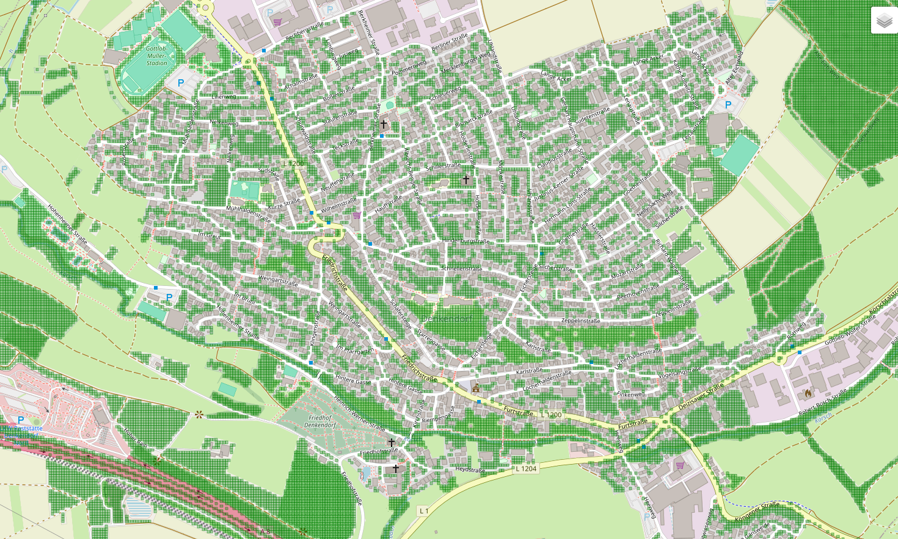

Stadtbegrünung mit Machine Learning

Dieses Projekt identifiziert geeignete Flächen in kleinen Städten und Kommunen für neue Baumpflanzungen. Ziel ist es, mithilfe öffentlich verfügbarer Geodaten die Abkühlung urbaner Räume zu unterstützen und Maßnahmen zur Klimaanpassung datenbasiert zu planen.

🔍 Projektübersicht

Datenquellen: OpenStreetMap (OSM)

Verwendete Technologien: Python, GeoPandas, scikit-learn, matplotlib

Ziel: Trainingsdatensätze erzeugen und Eignung von Rasterzellen modellbasiert bewerten

🧱 Bisherige Umsetzung

Datenimport: Gebäude, Straßen, Ausschlussflächen und Stadtgrenze werden automatisiert aus OSM geladen.

Rastererstellung: Die Stadtfläche wird in Zellen (10x10m) unterteilt.

Eignungsbewertung: Rasterzellen werden nach Mindestanforderungen (z.B. Abstand zu Gebäuden/Verkehr) vorbewertet.

Feature-Erweiterung: Weitere Daten wie Landnutzung werden automatisch annotiert und via One-Hot-Encoding für ML nutzbar gemacht.

Modelltraining: Ein Entscheidungsbaum (DecisionTreeClassifier) lernt aus den Daten und gibt Hinweise auf relevante Kriterien.

📊 Beispiel: Rasteranalyse mit Eignungsprüfung

  

Beispielhafte Darstellung eines analysierten Stadtbereichs mit geeigneten und ungeeigneten Rasterzellen.

📁 Projektstruktur

stadtbegruenung-ml/
├── main.py                 # Hauptprogramm zur Rasteranalyse\n
├── main_ml.py              # Separates ML-Trainingsskript
├── config.py               # Parameter (Ort, Schwellenwerte etc.)
├── modules/
│   ├── osm_loader.py       # OSM-Daten importieren
│   ├── raster.py           # Raster generieren
│   ├── eignung.py          # Eignungsbewertung
│   ├── features.py         # Zusatzfeatures (z. B. landuse)
│   ├── ml_dataset.py       # ML-Trainingsdaten vorbereiten
│   └── export.py           # Exportfunktionen (GeoJSON, CSV)
├── ml_daten/               # Exportierte CSVs für ML-Modelle
├── modell_entwicklung.py   # Auswertung des ML-Modells
└── karte.png               # Beispielhafte Karte (optional)

💡 Nächste Schritte

Validierung durch externe Geo- und Umweltdaten (z.B. Bodenversiegelung, Hitzeinseln)

Erweiterung der Feature-Auswahl (z.B. Baumabstand, Lichtverhältnisse)

Vergleich verschiedener ML-Modelle

👤 Autorin
Nathalie G., Weiterbildung zur Machine Learning Spezialistin, mit besonderem Fokus auf Umweltanwendungen und nachhaltige Stadtentwicklung.
📧 GitHub: nath-ga

## Weiterentwicklung

Dieses Projekt diente als erste Lernetappe im Umgang mit OpenStreetMap-Daten, Rasterlogik und einem einfachen Machine-Learning-Modell zur Stadtbegrünung.  
Der Schwerpunkt lag auf dem technischen Aufbau: Datenabruf, Zellbewertung und Modellerstellung.

**Stand: Juni 2025 – Projekt abgeschlossen.**

Auf Basis dieser Erfahrungen wird ein neues Projekt gestartet, das gezielt von „grünen Vorbild-Städten“ lernen soll.  
Das Ziel: eine realistischere Eignungsbewertung durch datengetriebene Analyse gut begrünter Orte.

➡️ Der Link zum neuen Projekt folgt.

